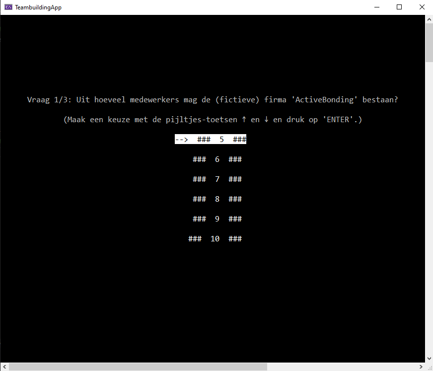
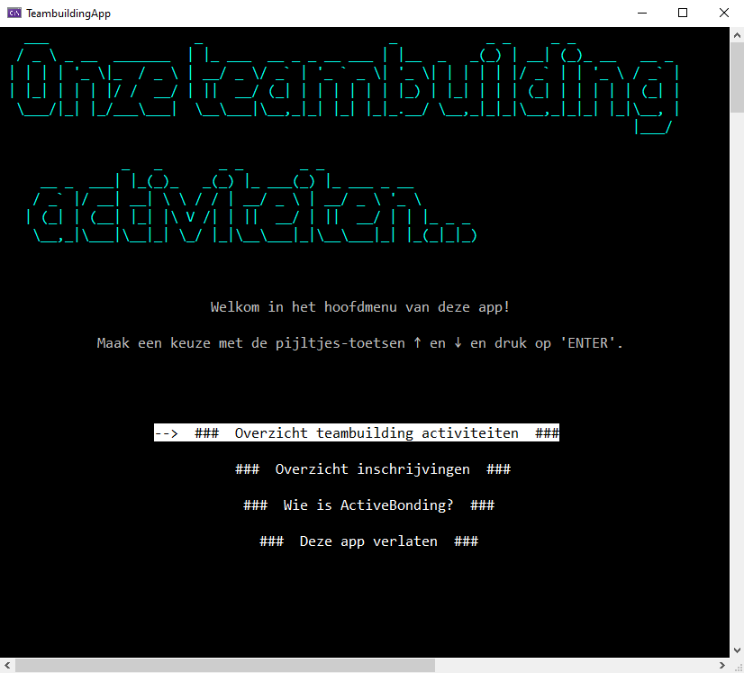
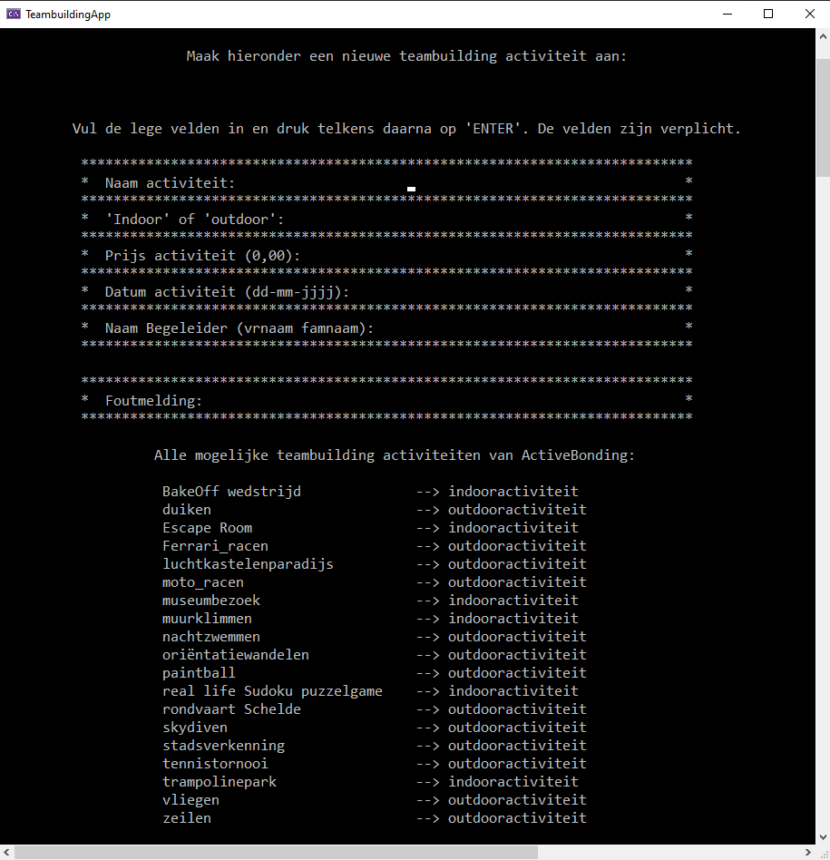
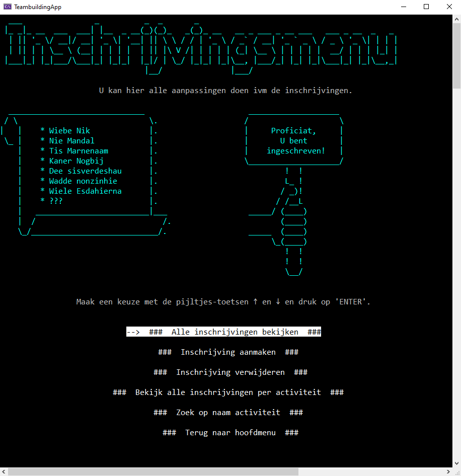
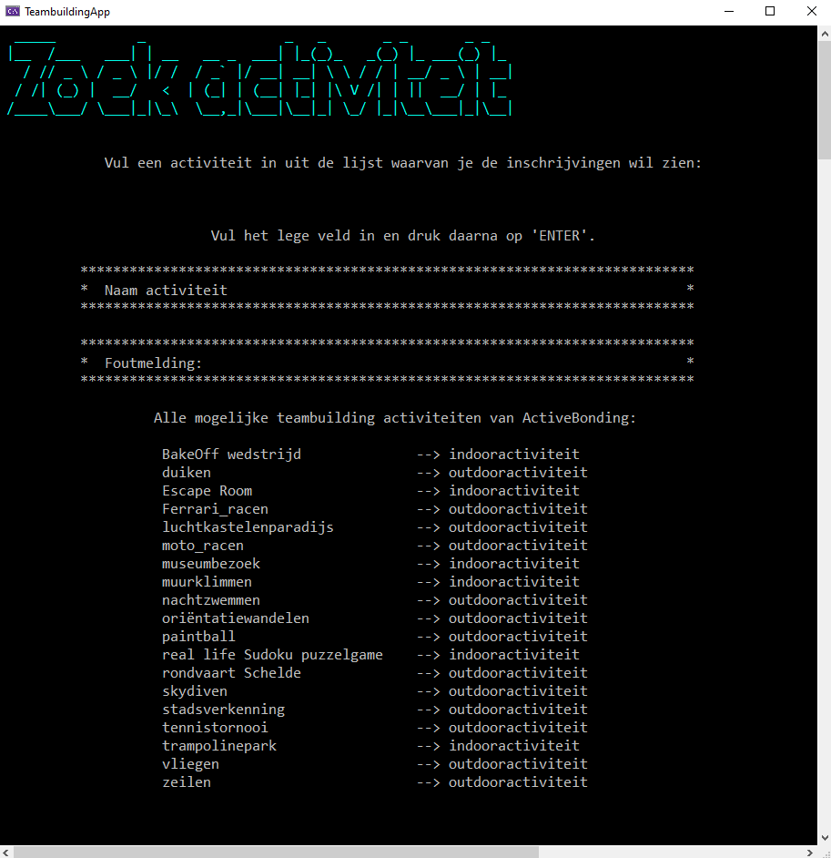

# Teambuilding Applicatie (Console app .Net5)
Dit is een volledig Nederlandstalige app in het kader van een OOP oefening voor beginnende developers in C#.
---
### De opdracht voor deze console applicatie was als volgt:
Een bedrijf gespecialiseerd in het organiseren van teambuilding wil graag het volgend systeem: 
* Er moeten activiteiten toegevoegd worden. Een activiteit heeft altijd minstens volgende info: Naam, Indoor/outdoor, begeleider, prijs.
* Personen kunnen een begeleider of deelnemer zijn, van een persoon is er minstens altijd een voornaam, achternaam en leeftijd gevraagd.
* Ook het bedrijf waar hij/zij voor werkt moet vermeld worden.
* Voorzie zeker de activiteit, duiken, parachute springen, muurklimmen. Voor deze activiteiten heeft moet de begeleider bekwaam zijn(array van attesten), anders kan deze niet toegekend worden aan de activiteit.
* Voorzie een lijst inschrijvingen(Persoon, Activiteiten, Datum)
* Voorzie een lijst met alle activiteiten en hun inschrijvingen ook wie de activiteit begeleidt.
* Zoekfunctie op activiteit en daarop de inschrijvingen.
* Voorzie ook dat de gebruiker zich kan inschrijven voor een andere activiteit.
---
### Enkele snapshots uit de applicatie:

